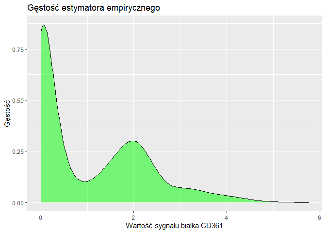

## 1.0 Opis danych

Narządy, takie jak trzustka, składają się z wielu typów tkanek, a te z kolei z wielu typów
komórek. W obrębie trzustki możemy wyróżnić komórki typowe wyłącznie dla tego narządu, takie jak komórki alfa czy beta, ale także komórki związane z ukrwieniem czy układem
immunologicznym.

Dane w tym zadaniu pochodzą z wielomodalnego sekwencjonowania pojedynczej komórki
(ang. multimodal single cell RNA sequencing, scRNA-seq). Użycie scRNA-seq pozwala na
studiowanie próbek w wysokiej rozdzielczości i oddzielenie od siebie komórek różnych typów.
Możliwe jest między innymi porównanie komórek patologicznych, pobranych od pacjentów
nowotworowych, z komórkami zdrowymi. W technologii multimodal scRNA-seq dla każdej
komórki otrzymujemy dwa typy odczytów:

* **Zliczenia transkryptów RNA** odpowiadające ekspresji (aktywności) genów w danej
komórce;
* **Ilość białek powierzchniowych** (ang. protein abundance), która jest wprost związana z typem danej komórki

Wynikiem eksperymentu *scRNA-seq* są macierze, w których dla każdej komórki przypisany jest sygnał RNA z wielu tysięcy genów (to jest X) oraz sygnał pochodzący z kilkudziesięciu białek powierzchniowych (dla uproszczenia wybraliśmy pojedyncze białko CD36, y).
Zgodnie z centralnym dogmatem biologii, wiemy, że informacja genetyczna przepływa z RNA
na białka. Tym samym, należy spodziewać się korelacji między ilością białka a ekspresją genu,
który to białko koduje. Z przyczyn technicznych i biologicznych, ta zależność niejednokrotnie
ulega degeneracji. Problem polega na predykcji sygnału z białek powierzchniowych na podstawie ekspresji genów. Przewidywanie sygnału protein abundance jest kluczowe
dla większości publicznie dostępnych zbiorów, dla których dostępna jest wyłącznie macierz
RNA. Analiza sygnału o ekspresji genów i ilości białek powierzchniowych znacząco ułatwia
proces identyfikowania i nazywania komórek w próbce.

Dane zostały pobrane z szpiku kostnego ludzkich dawców. Zebrane komórki to w większości
komórki układu immunologicznego. Prawidłowe zidentyfikowanie limfocytów typu T w oparciu
o oba typy odczytów w zbiorze takiego typu mogłoby być podstawą do rozwijania celowanych
terapii nowotworowych. 

* **X train.csv** oraz **X test.csv**, zawierają macierze RNA. Każdy wiersz odpowiada
komórce, kolumna genowi, natomiast wartości to poziom ekspresji. Kolumny tych macierzy to nasze zmienne objaśniające.

* **y train.csv**, odpowiada ilości białka powierzchniowego pewnego typu w komórkach (tych, których dotyczyły dane z pliku X train.csv). Jest to nasza zmienna objaśniana.

## 1.1 Początek analizy. Eksploracja

```{r}
X_train <- fread("E:/Study/MIMUW/6 semestr/SAD/Projekt zaliczeniowy/X_train.csv")
y_train <- fread("E:/Study/MIMUW/6 semestr/SAD/Projekt zaliczeniowy/y_train.csv")
X_test  <- fread("E:/Study/MIMUW/6 semestr/SAD/Projekt zaliczeniowy/X_test.csv")
```

Wczytujemy dane do naszego środowiska. 

Macierz `X_train` jest rozmiarów $6800 \times 9000$, zawiera $6800$ obserwacji, do których przypisano po $9000$ sygnałów RNA. 

Macierz `X_test` jest rozmiarów $1200 \times 9000$, zawiera $1200$ obserwacji, do których przypisano po $9000$ sygnałów RNA.

Vector `y_train` zawiera $6800$ sygnałów pochodzących z białka powierzchniowego CD71. Dopasowany jest do macierzy `X_train` 

Upewnimy się, że dane w `X_test` są komplente i numeryczne
```{r echo = TRUE}
all(sapply(X_test, is.numeric))
all(complete.cases(X_test))
```

Takie same sprawdzenie robimy dla `X_train` oraz `y_train`
```{r echo = TRUE}
all(sapply(X_train, is.numeric))
all(complete.cases(X_train))
all(sapply(y_train, is.numeric))
all(complete.cases(y_train))
```

Tak samo oczekujemy, że kolumny macierzy `X_train` będą się pokrywać z kolumnami macierzy `X_test`. Sprawdzmy to: 
```{r, echo = TRUE}
identical(colnames(X_test), colnames(X_train))
```

## 1.2 Analiza zmiennej objasnialnej 

Zacznijmy od zbierania podstawowych informacji o danych `y_train`  
```{r echo = TRUE}
summary(y_train)
```

Przedstawmy wykres gęstości rozkładu empirycznego zmiennej objaśnianej: 
```{r echo = TRUE}
ggplot(data = y_train, aes(x = CD36)) +geom_density(fill = "green", alpha = 0.5) +labs(title = "Gęstość estymatora empirycznego", x = "Wartość sygnału białka CD361", y = "Gęstość")
```
<!-- -->

Można osobno zobaczyć histogram tej zmiennej: 
```{r echo = TRUE}
ggplot(data = y_train, aes(x = CD36)) + geom_histogram(color="blue", fill="white")
```


Przydatnym będzie również zobaczyć wykres kwantylowy:
```{r echo = TRUE}
ggplot(data = y_train) + geom_qq(aes(sample = CD36), size=1.5, color="blue")
```

Na podstawie tego wykresu kwantylowego oraz histogramu możemy zauważyć, że dane znacznie odbiegają od rozkładu normalnego. Wartości odstające mogą mieć duży wpływ na rozkład, a dane mogą mieć "ciężkie ogony", co oznacza, że skrajne wartości są bardziej powszechne niż w rozkładzie normalnym. Taki rozkład może być trudny do analizy za pomocą metod statystycznych, które zakładają normalność. Zanim zacznijmy przeprowadzać testy statystyczne, zróbmy jescze jeden krok

## 1.3 Korelacja zmiennych

Treningowy dataset `X_train` zawiera $6800$ zmiennych. Wybierzmy z nich 250 najbardziej skorelowanych z y(zmienna objasniana) i zbudujmy na tej podstawie nową macierz `X_train_high_cor`
```{r, echo = TRUE}
correlated <- sapply(X_train, function(x) cor(x, y_train$CD36))
top250 <- names(sort(abs(correlated), decreasing = TRUE))[1:250]
X_train_high_cor <- X_train[, ..top250]
```

  Na podstawie tych danych mozemy zbudować mapę ciepła: 

```{r, echo = TRUE}
cor_matrix <- cor(X_train_high_cor)
cor_relations <- melt(cor_matrix)

ggplot(data = cor_relations, aes(x = Var1, y = Var2, fill = value)) +
  geom_tile() +
  scale_fill_viridis(discrete = FALSE) +
  labs(title = "Mapa ciepła korelacji", x = "Zmienna x", y = "Zmienna y") +
  theme(axis.text.x = element_blank(), axis.text.y = element_blank()) +
  coord_fixed()
```

Mapa ciepła korelacji pokazuje, że większość zmiennych ma niskie korelacje (zielone obszary) lub umiarkowane korelacje (przejścia w żółty). Obecność kilku żółtych plam w pobliżu przekątnej wskazuje na silne dodatnie korelacje między niektórymi parami zmiennych. Warto zwrócić szczególną uwagę na te zmienne, gdyż mogą one mieć istotne znaczenie w dalszej analizie.


## 2.1 Testy statystyczne

Wróćmy na chwilę do wykresu kwantylowego zmiennej y: 

```{r echo = TRUE}
ggplot(data = y_train) +
  geom_qq(aes(sample = CD36), size=0.5, color = "blue") +
  geom_qq_line(aes(sample = CD36))
```

Cieżko jest odczytać z tego wykresu jaka by mogła być średnia i wariancja rozkładu zmiennej y, ze wgłędu na ciężkie ogony tego rozkładu

## 2.2 Test statystyczny hipotezy zgodności zmiennej objaśnianej z rozkładem normalnym.


Aby przeprowadzić test statystyczny hipotezy zgodności zmiennej objaśnianej z rozkładem normalnym, najczęściej używamy testu *Shapiro-Wilka* lub testu *Kolmogorova-Smirnova*. Test Shapiro-Wilka jest często preferowany dla małych próbek, więc nie pasuje dla naszej analizy, ponieważ mamy dużą próbkę, zawierającą 6800 obserwacji. Ze wzgłędu na to przeprowadzamy test *Kolmogorova-Smirnova*. Jest on mniej wrażliwy na niewielkie odchylenia od normalności i lepiej radzi sobie z dużymi zbiorami danych.

Test Kolmogorova-Smirnova sprawdza hipotezę zerową, że dane pochodzą z rozkładu normalnego.

* **Hipoteza zerowa (H0)**: Dane są rozłożone normalnie.
* **Hipoteza alternatywna (H1)**: Dane nie są rozłożone normalnie.

```{r echo = TRUE}
ks.test(y_train, "pnorm")
```

Ponieważ p-wartość jest mniejsza niż 0.05, mamy podstawę do odrzucenia hipotezy zerowej. Możemy stwierdzić, że dane nie są zgodne z rozkładem normalnym na poziomie istotności 0.05


## 2.3 Badamy rozkład zmiennej najbardziej skorelowanej

Wybieramy z maciezy `X_train` zmienną najabardziej skorelowaną ze zmienną w vectorze `y_train`

```{r echo = TRUE}
# Wybieramy zmienne najbardziej skorelowane
correlations_matrix <- apply(X_train, 2, function (x) cor(x, y_train))
index <- order(correlations_matrix, decreasing = T)[1]
column_name_highest_correlated <- colnames(X_train)[index]
highest_correlated_vector <- X_train[, ..column_name_highest_correlated]
print(column_name_highest_correlated)
```

Widzimy, że najbardziej skorelowana kolumna danych odpowida bialkowi "BLVRB".

Żeby coś powiedzieć o rozkładzie danych odpowiadających tej kolumnie spórzmy na histogram: 


```{r}
ggplot(data = highest_correlated_vector, aes(x = BLVRB)) + geom_histogram(color="blue", fill="white")
```

Widzimy, że wartość zerowa przyjmowa jest znacznie dużo więcej razy niż wszystkie pozostale wartości. Sprawdźmy, czy jest szansa na rozkład normalny niezerowych wartości. 

Znormalizujemy wszystkie dane: 
```{r echo = TRUE}
highest_correlated_vector <- unlist(highest_correlated_vector)
highest_correlated_vector_norm <- (highest_correlated_vector - mean(highest_correlated_vector)) / sd(highest_correlated_vector)
```

Wybierzmy tylko dane niezerowe
```{r echo = TRUE}
highest_correlated_vector_norm <- highest_correlated_vector_norm[highest_correlated_vector_norm > 0.0001]
```

Zobaczmy jak wygłąda rozkład na histogramie: 
```{r echo = TRUE}
highest_correlated_vector_norm_df <- data.frame(value = highest_correlated_vector_norm)
ggplot(data = highest_correlated_vector_norm_df, aes(x = value)) + geom_histogram(color="blue", fill="white")
```

Sprawdźmy, czy jest to rozkład lognormalny przy pomocy testu Kolmogorova-Smirnova
* **Hipoteza zerowa (H0)**: Logarytm danych jest rozłożony normalnie.
* **Hipoteza alternatywna (H1)**: Logarytm danych nie jest rozłożony normalnie.
```{r echo = TRUE}
log_data <- log(highest_correlated_vector_norm_df)
ks.test(log_data, "pnorm")
```

Ponieważ p-wartość jest mniejsza niż 0.05, mamy podstawę do odrzucenia hipotezy zerowej. Możemy stwierdzić, że dane nie są zgodne z rozkładem lognormalnym na poziomie istotności 0.05
Mamy podstaw do myslenia, ze rozkład danych to jest kombinacja znanych rozkładow

Sprawdźmy, czy wybrana zmienna objaśniająca ma ten sam rozkład w zbiorze testowym i traingowym. Porównywanie median jest dość niestabilne dla wnioskowania równości rozkładów, ponieważ mamy bardzo skośny rozkład w przypadku danych trainingowych. Uważam, że dużo lepszym pomyslem będzie porównać średnie. Dla tego możemy użyć `t-test`

Wybieramy dane z obu zbiorów
```{r echo = TRUE}
highest_correlated_vector_train <- X_train[, ..column_name_highest_correlated]
highest_correlated_vector_train <- data.frame(value = highest_correlated_vector_train)

highest_correlated_vector_test <- X_test[, ..column_name_highest_correlated]
highest_correlated_vector_test <- data.frame(value = highest_correlated_vector_test)

```
* **Hipoteza zerowa (H0)**: dwa wektory mają te same średnie
* **Hipoteza alternatywna (H1)**: dwa wektory mają różne średnie

```{r echo = TRUE}
t.test(highest_correlated_vector_train, highest_correlated_vector_test)
```

Ponieważ p-wartość jest większa niż 0.05, nie mamy podstaw do odrzucenia hipotezy zerowej. Możemy stwierdzić, że zmiena objasniająca ma ten sam rozkład w obu zbiorach na poziomie istotności 0.05(poniewaz na takim poziomie istotnosci zgadzają się średnie, a zakładamy, że dla nas to warunek równości rozkładów)

## 3.0Elastic Net

Pierwszy model który zastosujemy to `Elastic Net`. O to są informacje wstępne odnośnie tego modelu: 


Model Elastic Net to metoda regresji, która łączy cechy Lasso i Ridge regresji.

**Parametry Elastic Net**

- \(\beta\): Współczynniki regresji, które są estymowane.
- \(\lambda\): Parametr regularyzacji, który kontroluje stopień regularyzacji.$\lambda \in [0, \infty)$
- \(\alpha\): Parametr mieszania, który kontroluje balans między Lasso (L1) i Ridge (L2) regularyzacją.$\alpha \in [0,1]$

**Optymalizowana funkcja**

Funkcja strat, którą minimalizuje model Elastic Net, jest następująca:

\[
L(\beta) = \frac{1}{2N} \sum_{i=1}^{N} (y_i - X_i^T \beta)^2 + \lambda [(1 - \alpha) \frac{1}{2} ||\beta||_2^2 + \alpha ||\beta||_1]
\]

gdzie:
- \(y_i\) — prawdziwa wartość zmiennej objaśnianej.
- \(X_i\) — wektor predyktorów dla \(i\)-tej obserwacji.
- \(\beta\) — wektor współczynników regresji.

**Hiperparametry**

- **\(\lambda\) (lambda)**: Reguluje ogólną siłę regularyzacji. Wyższe wartości prowadzą do silniejszej regularyzacji.
- **\(\alpha\) (alpha)**: Określa balans między regularyzacją L1 i L2.
  - Jeśli \(\alpha = 1\), to jest Lasso (tylko regularyzacja L1).
  - Jeśli \(\alpha = 0\), to jest Ridge (tylko regularyzacja L2).
  - Wartości pomiędzy 0 a 1 dają kombinację Lasso i Ridge.

\[
\begin{cases}
\alpha = 1 & \text{Regresja Lasso} \\
\alpha = 0 & \text{Regresja Ridge}
\end{cases}
\]

Przy czym: 

- **Regresja grzbietowa (Ridge)**: Otrzymujemy ją, gdy \(\alpha = 0\).
- **Regresja Lasso**: Otrzymujemy ją, gdy \(\alpha = 1\).

Rozważmy siatkę parametrów, z parametrami $\alpha \in \{0, 0.1, 0.3, 0.6, 1\}$, oraz $\lambda \in \{0.001, 0.01, 0.1, 1\}$.

Wybór $\alpha$ jest spowodowany charakterem danych, ponieważ spodziewamy się, że walidacja grzebietowa będzie tutaj bardziej skuteczna. 

Wybór $\lambda$ jest następujący ponieważ dane są podobnego rzędu wielkości i spodziewamy się słabej regularyzacji. 

Użyjmy $5$ zbiorów walidacji krzyżowej, ponieważ dla mniejszych wartości metoda nie jest szczególnie skuteczna, a dla większych wartości skuteczność jest nieproporcjonalna w stosunku do czasu obliczeń. 

Zbiór danych jest bardzo duży, więc duża liczba zbiorów nie zwiększa to szczególnie skuteczności, a mocno wpływa na czas obliczeń.

```{r echo = TRUE, cache=TRUE}
#dla powtarzania wyników
set.seed(1000) 
#Parametry walidacji krzyzowej
control = trainControl(method = "cv", number = 5)
#Robimy siatkę
grid <- expand.grid(alpha = c(0, 0.1, 0.3, 0.6, 1), lambda = c(0.001, 0.01, 0.1, 1))
#Tranujemy model
elastic_net <- train(x = X_train, y = y_train$CD36, method = "glmnet", trControl = control, tuneGrid = grid)
#Zapisujemy wyniki
cv_results <- elastic_net$resample
```

Sprawdźmy dla których parametrów dostaliśmy najlepszy model: 
```{r echo = TRUE}
elastic_net$bestTune
```

Czyli, $\lambda = 0.1$ oraz $\alpha = 0.1$

Przedstawmy wykres zaleznosci blędu od parametrów $\lambda$, $\alpha$, żeby lepej zromieć jakie parametry są dobrymi dla naszego modelu:
```{r}
plot(elastic_net)
```


Żeby zdobyć więcej informacji na temat rozkładu błędów RMSE dla różnych kombinacji parametrów możemy narysować wykres skrzypcowy (violin plot):
```{r echo = TRUE}
#dla powtarzania wyników
set.seed(1000)

#nasza siatka
grid <- expand.grid(alpha = c(0.1, 0.5, 1.0), lambda = c(0.01, 0.1, 1.0))

cv_results <- cv_results %>%
  mutate(hyperparameter = paste0(0 , 0.1 , 0.2 , 0.3, 0.6, 1))


ggplot(cv_results, aes(x = 0, y = RMSE, fill = hyperparameter)) +
  geom_violin(trim = FALSE) +
  geom_jitter(width = 0.2, size = 1.5, color = "blue", alpha = 0.7) +
  theme_minimal() +
  theme(axis.text.x = element_text(angle = 45, hjust = 1)) +
  labs(title = "Wykres skrzypcowy błędów średniokwadratowych,",
       x = "kombinacje hiperparametrów",
       y = "błędy średniokwadratowe (RMSE)",
       fill = "Hyperparametry") +
  theme(legend.position = "bottom")


```

Zaraz warto się upewnić czy nie mamy overfittingu, w związku z czym policzmy dwa błędy: walidacyjny oraz trainingowy: 

Błąd walidacyjny wynosi:

```{r echo = TRUE}
min(elastic_net$results$RMSE)
```

Błąd treningowy wynosi:

```{r echo = TRUE}
mean((predict(elastic_net, X_train) - y_train$CD36)^2)
```

Błąd walidacyjny jest dość duży, więc nie wystąpił overfitting. Błąd treningowy jest niższy od błędu walidacyjnego, więc model dobrze generalizuje się na nowe dane.

## 4.0 Lasy losowe
Kolejny model który zastosujemy w tym zadaniu to model lasów losowych

Do stworzenia modelu lasów losowych skorzystamy z metody `ranger`. 

Do siatki wybieramy hiperparametry *mtry*, *min.node.size* oraz *splitrule*. 

Pierwszy z nich określa liczbę losowo wybranych zmiennych, które będą brane pod uwagę przy podziale węzłów w drzewach, drugi minimalizuje liczbę obserwacji wymaganą do utworzenia węzła końcowego, a trzeci minimalizuje metrykę używaną do podziału węzłów drzewa. 

Dla parametru *mtry* rozważamy wartości $50, 100, 200$. $100$ - to jest prawie pierwiastek z liczby paramaetrow, robimy odstep od $100$ w dol i w gore dla wybrania trzech pozostalych parametrow. 

Dla parametru *min.node.size* rozważamy wartości $1, 5, 10$. 

Dla parametru *splitrule* rozważamy *variance* mierzącą wariancję wartości docelowej wokół średniej węzła oraz *extratrees* stosującą losowe podziały węzłów. 

Do wyboru najbardziej dopasowanego modelu korzystamy z walidacji krzyżowej o takich samych parametrach jak w poprzednim przypadku.

```{r echo=TRUE, cache=TRUE}
#dla powtorzalnosci wynikow
set.seed(1000)
#robimy te sama walidacje
control = trainControl(method = "cv", number = 5)
#robimy siatke
grid <- expand.grid(mtry = c(50, 100, 200), min.node.size = c(1, 5, 10), splitrule = c("variance", "extratrees"))
#trenujemy model lasow losowych1
random_forest <- train(x = X_train, y = y_train$CD36, method = "ranger", trControl = control, tuneGrid = grid)
```


Sprawdźmy dla których parametrów dostaliśmy najlepszy model:

```{r echo = TRUE}
random_forest$finalModel
```

Przedstawmy wykres zaleznosci blędu od wszystkich parametrów, żeby lepej zromieć jakie parametry są dobrymi dla naszego modelu:

```{r echo = TRUE}
plot(random_forest)
```
Zaraz warto się upewnić czy nie mamy overfittingu, w związku z czym policzmy dwa błędy: walidacyjny oraz trainingowy: 

Błąd walidacyjny wynosi:
```{r echo = TRUE}
min(random_forest$results$RMSE)
```

Błąd treningowy wynosi:
```{r echo = TRUE}
mean((predict(random_forest, X_train) - y_train$CD36)^2)
```

Błąd walidacyjny jest dość duży, więc nie wystąpił overfitting. Błąd treningowy jest niższy od błędu walidacyjnego, więc model dobrze generalizuje się na nowe dane.

Z wykresu blędów RMSE mozemy wyciągnąć, że parametr *variance* minimalizuje błąd lepej. Również, widzimy, że parametr *mtry* im jest większy, tym jest błąd RMSE mniejszy. 

Zostało nam narysować wykres box plot dla błędów średniokwadratowych, otrzymanych w poszczególnych foldach testowych walidacji krzyżowej (wartości na osi
Y) dla danego zestawu wartości hiperparametrów (na osi X). 

```{r echo = TRUE}
#Wyniki trenowania
resampling_results <- random_forest$results

#wyciągamy parametry
resampling_results$Hyperparameters <- with(resampling_results, 
                                           paste("mtry=", mtry, 
                                                 ", min.node.size=", min.node.size, 
                                                 ", splitrule=", splitrule, sep = ""))

# Create a box plot for RMSE values
ggplot(resampling_results, aes(x = Hyperparameters, y = RMSE, fill = Hyperparameters)) +
  geom_boxplot() +
  labs(title = "Wykres pudelkowy RMSE dla różnych hiperparametrów",
       x = "kombinacje hiperparametrów",
       y = "Błąd średniokwadratowy",
       fill = "Hyperparameters") +
  theme(axis.text.x = element_text(angle = 45, hjust = 1)) +
  theme(legend.position = "bottom")


```

## 5.0 Decyzja, który model wziąć 
Porównanie RMSE dla poszczególnych modeli przedstawia się następująco:

```{r}
table <- matrix(data = NA, nrow = 2, ncol = 3)

table[1, 1] <- min(elastic_net$results$RMSE)
table[1, 2] <- min(random_forest$results$RMSE)
table[1, 3] <- mean((mean(y_train$CD36) - y_train$CD36)^2)
table[2, 1] <- mean((predict(elastic_net, X_train) - y_train$CD36)^2)
table[2, 2] <- mean((predict(random_forest, X_train) - y_train$CD36)^2)
table[2, 3] <- mean((mean(y_train$CD36) - y_train$CD36)^2)

rownames(table) <- c("błąd walidacyjny", "błąd testowy")
colnames(table) <- c("ElasticNet", "las losowy", "średnia")

table
```

Dzięku temu, że stosowaliśmy te same podziały przy walidacji krzyżowej otrzymane wyniki można porównywać.
Oba wytrenowane modele są istotnie lepsze od modelu referencyjnego. Oba modeli mają podobne błędy walidacyjne. Lasy losową są mniej wydajne i znacznie dlużej się "uczą" niż model Elastic Net, jednak Las Losowy ma mniejszy o wiele bład testowy, więc ten model napewno jest według moejej analizy lepszy i będzie stosowany do predykcji na zbiorze testowym


